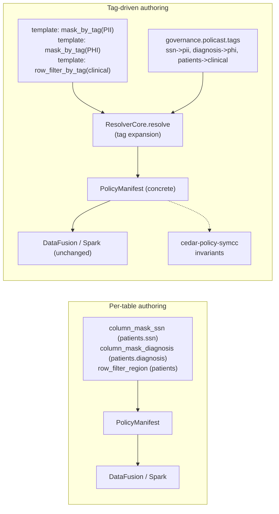

# Tag-Driven Cedar Templates for the Open Lakehouse

## Why now

`policast-cel` already proves that Cedar authored policies can be compiled to CEL and enforced portably across DataFusion and Spark. The remaining gap between "works on the healthcare demo" and "works on an enterprise catalog with thousands of tables" is the *authoring surface*: today every column mask and row filter names its target table and column literally, which means N policies per catalog and a linear maintenance cost as tables are added.

Every major commercial catalog (Snowflake Horizon, Unity Catalog on Databricks, BigQuery) has converged on the same primitive to solve this — **tags** — driving masking and row-filter decisions through a small, reviewable set of templates that attach to tag expressions rather than to individual securables. Cedar has a matching primitive (policy templates with slot variables), but no open-source lakehouse project currently drives it from catalog tags.

This plan closes that gap. When it is complete, policast-cel will:

- Accept Cedar *templates* as the primary authoring artifact.
- Use UC-stored tags as the binding surface between templates and concrete `(table, column)` pairs.
- Ship as a runnable `docker compose` stack so the story is reproducible in one command.
- Offer a Cursor skill that turns "what is this column?" into a tag edit, collapsing the learning curve to policy authoring.
- Prove invariants about the whole setup with SMT, so a governance reviewer can rely on machine-checked guarantees instead of code review vibes.

## Current state

| Layer | What exists | What is missing |
|-------|-------------|-----------------|
| `policast-core` | Cedar parser, CEL emitter, `CompiledPolicy { target_table, column, target_tag, applies_to_tag, cel_expression, ... }` model, `@target_tag` / `@applies_to_tag` annotation parsing, JSON manifest | SMT analysis hooks (Stage 5) |
| `policast-uc` | Resolver core with pluggable `ResolveBackend`; `FileBackend` (flat JSON); tag expansion; signed `ResolveBundle`; HTTP sidecar; `UcBootstrapBackend` with Delta-backed snapshot loader, dual access resolution (static template or UC REST table+temp-creds vending), RwLock row caches, periodic refresh task with optional bundle-cache invalidation fanout, and drop-aborts-task lifecycle (feature = `uc-bootstrap`) | Optional hardening: credential expiration-aware cache + proactive re-vend before expiry |
| `examples/` | Healthcare demo (template-based), `run_datafusion_uc.rs`, `run_datafusion_uc_http.rs` (verified against the live sidecar), UC DDL + flat store, tag seeds | A UC-backed twin of `run_datafusion_uc_http` that reads the patients table from MinIO |
| Compose stack | `docker/Dockerfile` (sidecar + demo + shell targets), `docker-compose.yml` includes `--profile uc-full` (MinIO + minio-init + UC v0.4.1 + uc-bootstrap init + sidecar-uc-full on `--backend uc-bootstrap`) while preserving the default flat-file flow, `docker/bootstrap/uc-full-init.sh` (DDL discovery + governance Delta seed), `Justfile` includes `uc-full-up / uc-full-demo / uc-full-down`, docs at `docs/unity-catalog/compose.md` + links from overview and docker/README | Optional hardening: run DDL against UC REST/SQL directly during bootstrap and add a live tag-edit smoke test in CI |
| `docs/` | `delta/overview.md`, `unity-catalog/overview.md` + `unity-catalog/compose.md`, `docker/README.md`, and `research/smt-invariants.md` (formalized invariant set) | Tag authoring guide polish + future `policast analyze` implementation notes |
| `.cursor/skills` | `tag-columns` skill + 4 starter templates (pii, phi, financial, clinical) + `policy-qa-generator` skill for interview-driven Cedar authoring | Skill fixture tests (optional hardening) |



## Design

### Data model (item 1)

`CompiledPolicy` gains two optional string fields:

```rust
pub struct CompiledPolicy {
    pub id: String,
    pub effect: Effect,
    pub filter_type: FilterType,
    pub target_table: String,          // may be "*" when target_tag is set
    pub column: Option<String>,        // None when applies_to_tag is set
    pub target_tag: Option<String>,    // NEW: table-level tag expression
    pub applies_to_tag: Option<String>,// NEW: column-level tag expression
    pub cel_expression: String,
    pub applies_to: Option<AppliesTo>,
    pub description: Option<String>,
}
```

The tag expression is a plain string for v1 (a single tag name). The plan explicitly *does not* ship a tag algebra in this phase — `"pii"`, not `"pii AND NOT public"` — because the grammar interacts with SMT analysis and we want to lock the storage shape first. Future work can extend the string into an expression without breaking the manifest contract.

Cedar annotations:

```cedar
@id("mask_pii_non_clinical")
@filter_type("column_mask")
@applies_to_tag("pii")              // NEW: expand per column tagged pii
@applies_to_roles(["analyst","intern"])
forbid (principal, action, resource)
when { principal.role != "physician" };
```

A Cedar policy must specify exactly one of `(target_table, target_tag)` and at most one of `(column, applies_to_tag)`. `compile_single_policy` enforces that.

### Tag index (item 2)

New Delta table under the `governance.policast` schema:

```sql
CREATE TABLE governance.policast.tags (
    entity       STRING NOT NULL,  -- 'catalog.schema.table' or 'catalog.schema.table:column'
    entity_kind  STRING NOT NULL,  -- 'table' | 'column'
    tag          STRING NOT NULL,
    set_by       STRING NOT NULL,
    set_at       TIMESTAMP NOT NULL,
    retired_at   TIMESTAMP
) USING DELTA
  PARTITIONED BY (tag)
  TBLPROPERTIES ('delta.enableChangeDataFeed' = 'true');
```

Matching `TagRow` in `policast-uc::backend`, plus `tags.json` in the flat store for tests and examples.

The resolver's `ResolveBackend` trait gains:

```rust
async fn tags(&self) -> Result<Vec<TagRow>, UcError>;
```

with a default `Ok(Vec::new())` implementation so older backends don't break.

### Tag expansion (item 3)

In `ResolverCore::resolve`, after the existing binding filter produces the candidate `CompiledPolicy` list, a new expansion step:

```text
for each policy in candidates:
    if policy.target_tag is Some or policy.applies_to_tag is Some:
        entities = tag_index.lookup(policy.target_tag or policy.applies_to_tag)
        for each entity in entities:
            emit a concrete policy with target_table/column filled in
            (and target_tag/applies_to_tag cleared so engines never see them)
    else:
        emit policy as-is
```

The expansion runs server-side, inside the sidecar, before the bundle is signed. Engines therefore see exactly the same `PolicyManifest` shape they see today — *no changes to `policast-datafusion` or `policast-spark` in this plan at all*. That is the key architectural property: tags are a publisher-side concept.

The `ResolveBundle` gains an `expanded_from` map (policy_id → tag_expression) for audit/debug purposes; it is signed alongside the manifest.

### Production backend for the sidecar (Stage 3 — decision locked)

`FileBackend` is the only `ResolveBackend` that exists today as a
fully-wired implementation. The compose demo in stage 3 cannot ship
on `FileBackend` forever — running UC 0.4.1 next to the sidecar only
tells a half-story if the governance state still lives in a JSON blob
mounted into the sidecar image.

Three shapes were evaluated:

| Shape | What reads the four governance Delta tables | Storage creds | When to pick it |
|-------|---------------------------------------------|---------------|-----------------|
| **`DeltaBackend` (direct)** | `deltalake` crate inside the sidecar process | held by the sidecar | single-tenant deployment where sidecar and UC share a trust boundary |
| **`UcRestBackend`** | UC REST API resolves the four tables, vends credentials, then `deltalake` opens them | vended per-call by UC | multi-tenant UC deployments; keeps UC on the credential vending path (the project's thesis) |
| **`UcBootstrapBackend`** | UC REST at startup snapshots rows; then a CDF listener on `manifest` and `tags` invalidates cached rows | vended once at startup, refreshed on CDF events | simplest operationally; best fit for the compose demo |

**Decision: ship `UcBootstrapBackend`.** Rationale:
1. *Respects the UC-as-PDP thesis.* Credentials for the four
   governance tables are vended by UC at startup — the sidecar never
   has an out-of-band path to the storage bucket. This is the same
   guarantee that `GovernedTable` already relies on for user data.
2. *Performance story is tractable.* Resolve-path reads hit an
   in-memory snapshot, not UC, so resolve latency stays at flat-file
   speed. UC is only in the slow path at startup and on CDF deltas.
3. *Freshness is explicit.* CDF on `manifest` and `tags` gives a
   clear, auditable invalidation signal. No TTL guessing, no
   full-table refetch cadence — the snapshot moves forward only when
   a governance admin commits a Delta change.
4. *Smallest surface to ship for the compose demo.* Exactly two
   things to build: the UC REST snapshot loader and the CDF tail
   loop. `UcRestBackend` adds a credential-vending interceptor on
   every resolve; `DeltaBackend` adds bucket-credentials management
   to the sidecar. Both are larger than what we need.

`UcRestBackend` is the next backend to land once the compose demo
validates the freshness model — it is the right long-term shape for
multi-tenant UC deployments where per-principal credential scoping
matters. `DeltaBackend` is documented as a single-tenant fallback
but deliberately not featured.

All three implement the `ResolveBackend` trait and therefore benefit
from the `tags()` default-impl contract already in place: adding any
of them does not break the others, and the tag-expansion algorithm
below is agnostic to which one is wired in.

### Docker-compose stack (items 4–7)

One command to stand up:

```
compose/
├── docker-compose.yaml
├── minio/   (bucket = policast-demo)
├── unitycatalog/  (v0.4.1 config + conf dir)
├── bootstrap/     (SQL + policy publish init container)
└── sidecar/       (policast-uc Dockerfile)
```

Bringup order: `minio` → `unitycatalog` → `bootstrap` (one-shot, exits 0) → `policast-uc-sidecar`. The DataFusion demo runs as a separate `just uc-compose-demo` command against the running stack.

Bootstrap installs the healthcare demo end-to-end:
1. Creates catalog/schema/volume via UC.
2. Materializes `hospital.clinical.patients` as a Delta table on MinIO.
3. Runs all `examples/uc/ddl/*.sql`.
4. Runs `policast uc publish` with the *template* policies.
5. Seeds the tags table with `ssn→pii, diagnosis→phi, patients→clinical`.

### Cursor skill (items 8–10)

`.cursor/skills/tag-columns/SKILL.md` activates on prompts like "help me tag columns in `hospital.clinical.patients`" or "what policies apply to this table?". The skill:

1. Reads column metadata via UC REST (or the flat store when `UC_ENDPOINT` is unset).
2. Walks the user column-by-column, asking a narrow classification question (`pii | phi | financial | public`).
3. Emits a unified diff for `tags.json` (flat mode) or a `MERGE` against `governance.policast.tags` (Delta mode).
4. Offers to link a canonical template from `skills/tag-columns/templates/` if no policy yet covers the tag.

A golden-file test under `tests/skill_tag_columns/` pins the expected output for the `patients` schema.

### SMT invariants (items 11–14)

The `policast-core` crate gains an optional `symcc` feature pulling `cedar-policy-symcc`. A new `policast analyze` subcommand reads the *expanded* manifest (the sidecar can dump it with `/admin/dump`) plus an invariants file and reports `holds` / `counterexample`.

Three invariants ship with the plan:

| Invariant | Statement |
|-----------|-----------|
| `pii_requires_physician` | ∀ principal, resource: if a column is tagged `pii` and principal.role ≠ `physician`, then the column_mask fires |
| `legal_hold_dominates_region` | ∀ principal, resource: the `deny_legal_hold` forbid overrides every `row_filter_region` permit |
| `tag_expansion_monotonic` | Adding a tag to a column only restricts visibility, never widens it |

CI runs the analyzer on every push; a failing invariant fails the build with the counter-example attached as an annotation.

## Execution order

The plan is deliberately layered so each stage leaves `main` in a shippable state:

1. **Core model + annotations** (items in sub-plan #1) — merges alone, with no behavior change because no resolver yet expands tags; existing manifests still compile; new fields are optional.
2. **UC tag backend + expansion** (items in sub-plan #2) — adds the tag table, the backend, the expansion; the healthcare demo starts using templates.
3. **Docker-compose stack** (items in sub-plan #3) — reuses `feat/docker-compose-stack`'s in-flight work; merges on top of #1+#2 so the demo shows tag expansion working end-to-end.
4. **Cursor tagging skill** (items in sub-plan #4) — depends on the tag index being real; can land in parallel with #3.
5. **SMT invariants** (items in sub-plan #5) — capstone; depends on the expanded manifest shape being stable.

Each stage will get its own `.cursor/plans/*.plan.md` with detailed TODOs. This document is the epic tracker; it links to the sub-plans as they are created.

## Non-goals for this epic

- **No tag algebra.** `target_tag` is a bare tag name for v1. Expressions like `pii AND NOT public` are explicitly deferred.
- **No engine-side tag awareness.** `policast-datafusion` and `policast-spark` do not learn about tags. Expansion happens in the publisher/resolver only.
- **No automatic tag classification.** The Cursor skill asks the user; it does not run an ML model over column contents.
- **No tag lifecycle / governance workflow.** Retiring a tag, approvals on a tag change, and tag access control itself are out of scope (they reuse UC's existing permission model).

## Success criteria

- `cargo test --workspace` is green after each stage.
- `just uc-compose-demo` prints the same governed output it does today, but the underlying policies are 3 templates instead of 6 hand-written rules.
- Adding a new clinical table to the compose stack (plus a tag assignment) automatically inherits `pii`/`phi` masks with zero policy edits.
- `policast analyze` passes the three shipped invariants and rejects a deliberately-broken policy that violates one of them.
- A data owner can go from "here is a new table" to "it is governed" using only the Cursor skill plus a template.
