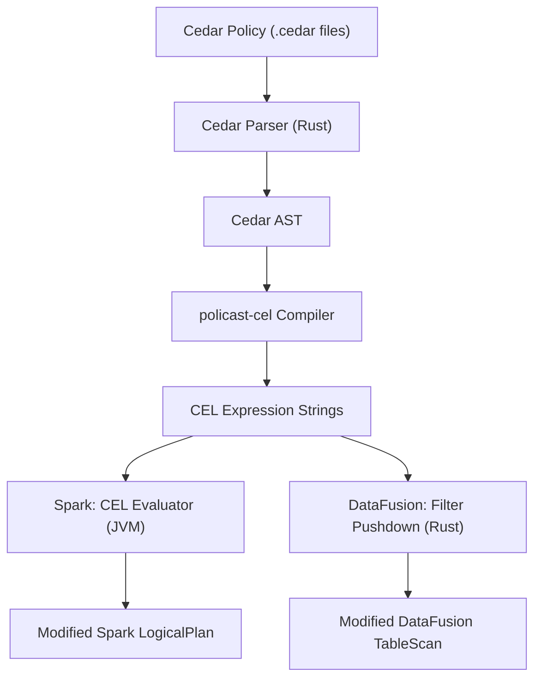

# Cedar-to-CEL Policy Compiler for Data Governance

## Problem Statement (POC)

**Healthcare data governance**: A `patients` table contains columns like `patient_id`, `name`, `ssn`, `diagnosis`, `region`, `treating_physician`. Governance policies enforce:

- **Row filtering**: Analysts can only see patients in their assigned region. Physicians can see only their own patients.
- **Column masking**: Only users with `role == "admin"` or `role == "physician"` see `ssn` and `diagnosis` unmasked. Everyone else sees `"***"` or a hash.
- **Deny override**: Nobody can access records tagged `legal_hold == true` unless they have `role == "legal"`.

These policies are authored once in Cedar, compiled to CEL, then enforced at query time in both Spark and DataFusion.

## Architecture



## Language Strategy

| Component | Language | Rationale |
|-----------|----------|-----------|

- **Core compiler (Cedar AST to CEL)**: Rust -- Cedar's official parser (`cedar-policy` crate) is Rust-native; CEL output is string-based so no CEL library is needed for generation
- **DataFusion integration**: Rust -- native, uses `cel-interpreter` crate for runtime eval or string-based filter injection
- **Spark integration**: Scala -- uses `cel-java` (Google's official JVM CEL) for runtime eval; calls the Rust core via JNI or uses a pre-compiled policy store (JSON/protobuf)
- **Cross-language bridge**: The Rust compiler outputs CEL expression strings (portable text) or a JSON policy manifest. No JNI needed for the POC -- Spark reads the compiled CEL from a policy store file.

## Project Structure

```
policast-cel/
  policast-core/              # Rust crate - Cedar parser + CEL compiler
    Cargo.toml
    src/
      lib.rs                  # Public API
      cedar_parser.rs         # Wraps cedar-policy crate, extracts conditions
      cel_emitter.rs          # Walks Cedar AST, emits CEL expression strings
      policy_manifest.rs      # Serializable policy manifest (JSON)
      model.rs                # Domain types: PolicyRule, FilterType, etc.

  policast-datafusion/        # Rust crate - DataFusion integration
    Cargo.toml
    src/
      lib.rs
      governance_table.rs     # Wrapping TableProvider with filter injection
      cel_filter.rs           # CEL expression -> DataFusion Expr conversion

  policast-spark/             # Scala (sbt) - Spark integration
    build.sbt
    src/main/scala/
      com/policast/spark/
        PolicastPlugin.scala          # Implements SparkPlugin
        PolicastDriverPlugin.scala    # Loads policy manifest at driver init
        PolicastOptimizerRule.scala   # Catalyst Rule[LogicalPlan] for row/col filters
        CelEvaluator.scala            # Wraps cel-java for runtime eval

  examples/
    policies/                 # Cedar policy files for the healthcare POC
      row_filter.cedar
      column_mask.cedar
      deny_legal_hold.cedar
    data/
      patients.csv            # Sample data
    run_datafusion.rs         # DataFusion demo
    run_spark.scala           # Spark demo
```

## Core Compiler Design (Rust)

### Step 1: Parse Cedar policies

Use `cedar-policy` crate's public API:

```rust
use cedar_policy::{PolicySet, Policy};

let policy_text = std::fs::read_to_string("row_filter.cedar")?;
let policies = PolicySet::from_str(&policy_text)?;
for policy in policies.policies() {
    // Access: policy.effect(), policy.principal_constraint(),
    //         policy.action_constraint(), policy.resource_constraint()
    // The conditions (when/unless) contain the expressions to translate
}
```

Alternatively, use the JSON/EST representation via `Policy::to_json()` which produces a well-structured JSON tree where each expression node has a clear operator key (`"=="`, `"&&"`, `"."`, `"has"`, `"like"`, etc.) that maps cleanly to CEL.

### Step 2: Walk Cedar expressions and emit CEL

The Cedar JSON EST maps to CEL almost 1:1 for the subset we need:

- Cedar `==`, `!=`, `<`, `>`, `<=`, `>=` -> CEL `==`, `!=`, `<`, `>`, `<=`, `>=`
- Cedar `&&`, `||`, `!` -> CEL `&&`, `||`, `!`
- Cedar `resource.column_name` -> CEL `resource.column_name`
- Cedar `context.user_role` -> CEL `request.auth.role` (configurable mapping)
- Cedar `has` (attribute existence) -> CEL `has(resource.field)`
- Cedar `like` (wildcard match) -> CEL `resource.field.matches(regex)`
- Cedar `if-then-else` -> CEL ternary `condition ? then_expr : else_expr`
- Cedar `in` (set membership) -> CEL `value in [list]`

The compiler walks the EST recursively and produces a CEL string:

```rust
fn cedar_expr_to_cel(expr: &serde_json::Value) -> String {
    match expr {
        // Binary ops
        obj if obj.get("==").is_some() => {
            let op = obj.get("==").unwrap();
            format!("{} == {}", 
                cedar_expr_to_cel(&op["left"]),
                cedar_expr_to_cel(&op["right"]))
        }
        // Attribute access
        obj if obj.get(".").is_some() => {
            let dot = obj.get(".").unwrap();
            format!("{}.{}", 
                cedar_expr_to_cel(&dot["left"]),
                dot["attr"].as_str().unwrap())
        }
        // ... other node types
    }
}
```

### Step 3: Output a policy manifest

```json
{
  "version": "1.0",
  "policies": [
    {
      "id": "row_filter_region",
      "effect": "permit",
      "target_table": "patients",
      "filter_type": "row_filter",
      "cel_expression": "resource.region == request.auth.region",
      "applies_to": { "roles": ["analyst"] }
    },
    {
      "id": "column_mask_ssn",
      "effect": "permit",
      "target_table": "patients",
      "filter_type": "column_mask",
      "column": "ssn",
      "cel_expression": "request.auth.role in ['admin', 'physician'] ? resource.ssn : '***'",
      "applies_to": { "roles": ["*"] }
    }
  ]
}
```

## DataFusion Integration (Rust)

Wrap an existing `TableProvider` with a governance layer:

```rust
struct GovernedTable {
    inner: Arc<dyn TableProvider>,
    row_filters: Vec<CompiledPolicy>,   // CEL expressions for row filtering
    column_masks: Vec<ColumnMaskPolicy>, // CEL expressions for column masking
}
```

Implement `TableProvider` on `GovernedTable`:
- In `scan()`, inject additional `Expr::Filter` nodes from the compiled CEL row-filter expressions
- For column masks, rewrite the projection to wrap masked columns in conditional expressions
- Use `cel-interpreter` crate to parse CEL strings back into DataFusion `Expr` trees, or build a small CEL-string-to-DataFusion-Expr translator

## Spark Integration (Scala)

### SparkPlugin implementation

```scala
class PolicastPlugin extends SparkPlugin {
  override def driverPlugin(): DriverPlugin = new PolicastDriverPlugin()
  override def executorPlugin(): ExecutorPlugin = null // not needed
}
```

### DriverPlugin loads policies and registers Catalyst rule

```scala
class PolicastDriverPlugin extends DriverPlugin {
  override def init(sc: SparkContext, pluginContext: PluginContext): JMap[String, String] = {
    val manifest = PolicyManifest.load("policies/manifest.json")
    // Register via SparkSessionExtensions or store in broadcast
    sc.setLocalProperty("policast.manifest", manifest.toJson)
    Collections.emptyMap()
  }
}
```

### Catalyst optimizer rule

Register via `spark.sql.extensions` config:

```scala
class PolicastExtensions extends (SparkSessionExtensions => Unit) {
  override def apply(ext: SparkSessionExtensions): Unit = {
    ext.injectOptimizerRule(session => new PolicastRowFilterRule(session))
  }
}
```

The rule intercepts `LogicalRelation` / table scan nodes, looks up the table in the policy manifest, and injects `Filter` nodes using CEL expressions evaluated by `cel-java`:

```scala
class PolicastRowFilterRule(session: SparkSession) extends Rule[LogicalPlan] {
  override def apply(plan: LogicalPlan): LogicalPlan = plan.transformUp {
    case rel @ LogicalRelation(_, output, catalogTable, _) =>
      val tableName = catalogTable.map(_.identifier.table).getOrElse("")
      val policies = manifest.policiesForTable(tableName)
      policies.foldLeft(rel: LogicalPlan) { (p, policy) =>
        Filter(celToSparkExpr(policy.celExpression, output), p)
      }
  }
}
```

## Example Cedar Policies for the POC

**Row filter (region-based)**:
```
@id("row_filter_region")
permit (
    principal is Analyst,
    action == Action::"query",
    resource is Table
)
when {
    resource.region == principal.region
};
```

**Column mask (SSN)**:
```
@id("column_mask_ssn")
permit (
    principal,
    action == Action::"query",
    resource is Table
)
when {
    resource.table_name == "patients"
}
unless {
    principal.role == "admin" || principal.role == "physician"
};
```
(The "unless" triggers masking -- if the principal is NOT admin/physician, the SSN column is masked.)

**Deny override (legal hold)**:
```
@id("deny_legal_hold")
forbid (
    principal,
    action,
    resource is Table
)
when {
    resource.legal_hold == true
}
unless {
    principal.role == "legal"
};
```

## Key Dependencies

**Rust (policast-core + policast-datafusion)**:
- `cedar-policy` -- parse Cedar policies, access AST/EST
- `serde`, `serde_json` -- serialize policy manifests
- `cel-interpreter` -- (optional) validate generated CEL expressions
- `datafusion` -- DataFusion integration

**Scala (policast-spark)**:
- `dev.cel:cel:0.12.0` -- Google's official CEL-Java library
- `org.apache.spark:spark-sql` -- Spark SQL with Catalyst
- `com.google.code.gson` or `circe` -- JSON manifest parsing
