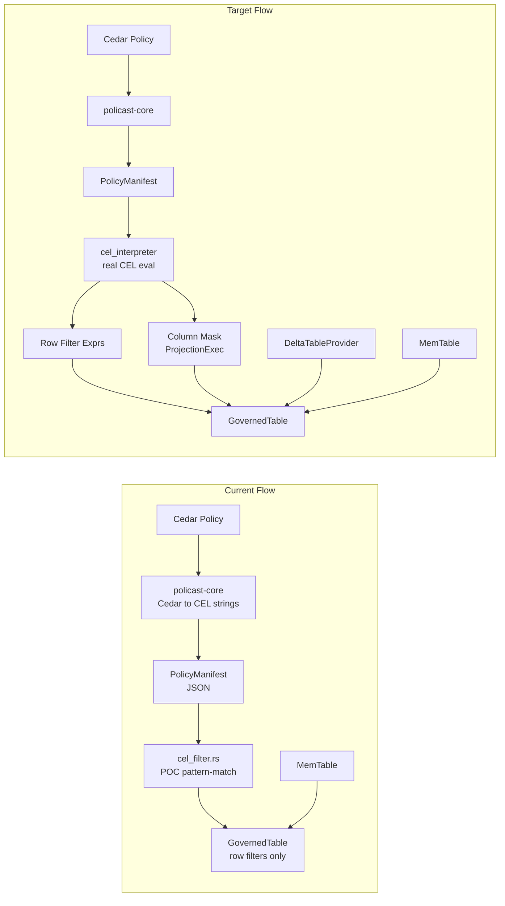

# Extend policast-datafusion: Row Filters, Column Masks, and Delta-rs Support

## Current State

The `policast-datafusion` crate has two critical gaps:

1. **CEL translation is a POC stub** -- [cel_filter.rs](policast-datafusion/src/cel_filter.rs) uses `contains()` string matching to recognize a handful of hardcoded CEL patterns instead of parsing/evaluating CEL. The `cel-interpreter` crate is declared as a dependency but never imported.

2. **Column masks are metadata-only** -- `GovernedTable::masked_columns()` returns `(column, mask_value)` pairs, but `scan()` never rewrites the projection. The [run_datafusion.rs](examples/run_datafusion.rs) example just prints mask info; masked columns still appear in query results unmasked.

3. **No Delta Lake support** -- The only demonstrated `TableProvider` is `MemTable`. There is no `deltalake` dependency.



---

## Part 1: Real CEL-to-Expr Translation

Replace the hardcoded pattern-matching in `cel_filter.rs` with actual CEL interpretation using the `cel-interpreter` crate (already declared in `Cargo.toml`).

**Approach:**
- Parse CEL strings with `cel_interpreter::Program` (or equivalent parser API).
- Walk the parsed AST to produce DataFusion `Expr` nodes. Map `resource.*` references to `col()`, `principal.*` references to `lit()` (bound from `QueryIdentity`), and operators (`==`, `&&`, `||`, `!`, `>`, `<`, `has`, `like`) to their DataFusion equivalents.
- Create a new module `src/cel_to_expr.rs` dedicated to the AST-to-Expr conversion, keeping `cel_filter.rs` as the orchestration layer that calls it.
- Fall back gracefully: if a CEL expression uses constructs that can't map to `Expr` (e.g., function calls, lists), log a warning and skip the filter rather than panic.

**Key files:**
- New: `policast-datafusion/src/cel_to_expr.rs`
- Edit: `policast-datafusion/src/cel_filter.rs` -- replace `cel_row_filter_to_expr`, `cel_deny_override_to_expr`, and `should_mask_for_identity` to use the new translator.
- Edit: `policast-datafusion/src/lib.rs` -- add `pub mod cel_to_expr`.

---

## Part 2: Column Mask Enforcement in the Query Plan

Column masks must be enforced at the physical plan level so that masked values never reach the caller, regardless of the SQL they write.

**Approach:**
- In `GovernedTable::scan()`, after obtaining the `ExecutionPlan` from the inner provider, wrap it in a `ProjectionExec` that replaces masked columns with literal values.
- For each column in the output schema:
  - If it appears in `build_column_masks()` results, replace it with a `Literal` physical expression (cast to the column's original type for Utf8, or a `null` literal for non-string types).
  - Otherwise, pass it through with a `Column` physical expression.
- Respect the caller's projection: if the caller didn't request a masked column, no wrapping is needed for that column.

**Key changes in `governance_table.rs`:**

```rust
async fn scan(&self, state, projection, filters, limit) -> ... {
    let governance_filters = build_row_filters(...)?;
    let mut all_filters = filters.to_vec();
    all_filters.extend(governance_filters);

    let inner_plan = self.inner.scan(state, projection, &all_filters, limit).await?;

    let masks = build_column_masks(&self.manifest, &self.table_name, &self.identity);
    if masks.is_empty() {
        return Ok(inner_plan);
    }

    // Build ProjectionExec wrapping inner_plan
    apply_column_masks(inner_plan, &masks, projection, &self.inner.schema())
}
```

New helper `apply_column_masks` returns `Arc<dyn ExecutionPlan>` wrapping the input with a `ProjectionExec`.

---

## Part 3: Delta-rs Integration

Since `GovernedTable` wraps `Arc<dyn TableProvider>`, and delta-rs's `DeltaTableProvider` implements `TableProvider`, the integration is straightforward: align DataFusion versions, add the dependency, and provide convenience constructors.

**Version alignment:**
- The latest `deltalake` crate (0.31.x) uses DataFusion 47+. Options:
  - **(Recommended)** Upgrade `policast-datafusion` from `datafusion = "46"` to `datafusion = "47"` and add `deltalake = "0.31"`. This gets us the latest of both.
  - Alternatively, pin `deltalake` to the version that targeted DataFusion 46 (from the March 2025 PR). This limits future compatibility.

**New code:**
- Add a feature-gated `delta` module: `policast-datafusion/src/delta.rs` behind a Cargo feature `delta`.
- Provide `GovernedDeltaTable::open(uri, manifest, table_name, identity)` that:
  1. Opens a `DeltaTable` from a URI (local path, S3, GCS, ADLS via delta-rs's object_store integration).
  2. Wraps its `DeltaTableProvider` in `GovernedTable`.
- Add a Delta Lake example: `examples/run_datafusion_delta.rs`.

**Cargo.toml changes:**

```toml
[features]
default = []
delta = ["dep:deltalake"]

[dependencies]
deltalake = { version = "0.31", optional = true }
datafusion = "47"  # upgraded from 46
```

---

## Part 4: Tests

Following the workspace testing rule (target ~80% coverage):

| Area | Tests |
|------|-------|
| `cel_to_expr.rs` | Table-driven: eq, neq, and, or, not, gt, lt, has, like, nested, resource vs principal binding, unsupported-expression fallback |
| `cel_filter.rs` | Existing tests updated to use real CEL; add edge cases (empty expression, wildcard table) |
| `governance_table.rs` | Integration test: register GovernedTable over MemTable, run SQL, assert masked columns return `***` and filtered rows are excluded |
| `delta.rs` | Integration test with a small local Delta table (create with deltalake, wrap with GovernedTable, query) -- behind `#[cfg(feature = "delta")]` |

---

## Execution Order

Work proceeds bottom-up so each layer is testable before the next depends on it:

1. `cel_to_expr.rs` (pure function, no IO)
2. Rewire `cel_filter.rs` to use it
3. Column mask enforcement in `governance_table.rs`
4. DataFusion version upgrade + delta feature gate
5. `delta.rs` convenience module + example
6. End-to-end tests and coverage check
