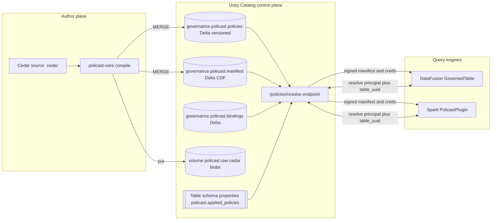

# Unity Catalog as a Policy Decision Point for policast-cel

Status: design / research  
Author: policast-cel maintainers  
Related plan: `.cursor/plans/unity_catalog_policy_store_17fe4c4c.plan.md`

## Abstract

Open-source Unity Catalog (UC-OSS) exposes a REST-first control plane for
lakehouse metadata but lacks first-class governance primitives: no policy
object, no row/column scoping, no policy language integration. This
document proposes turning UC itself into a **Policy Decision Point (PDP)**
for policast-cel by reusing UC's own metadata store — Delta tables and
property dictionaries — as the backing store for Cedar sources, compiled
CEL manifests, and principal→policy bindings. A single `/policies/resolve`
endpoint (or identical-contract sidecar) returns a signed bundle of
credentials + compiled manifest to query engines, mirroring Lakekeeper's
"authorizer gates credential vending" pattern and Polaris's hierarchical
securable/role/grant model.

## 1. Motivating gap in UC-OSS

| Capability | UC-OSS status | What governance actually needs |
|---|---|---|
| Catalog / schema / table metadata | First-class | First-class |
| Table/column property dictionaries | Present but underused | Primary binding surface |
| Credential vending for storage | Present | Must be gated on attribute-level decisions |
| Privileges on securables | Coarse grant on `SELECT`, `USE CATALOG`, etc. | Fine-grained row/column scoping |
| Policy object (row filter / column mask) | **Missing** | **Required** |
| Policy language integration | **Missing** (nothing like Cedar/Rego/CEL) | **Required** |
| Attribute-based access control (ABAC) | **Missing** | Required for principal.region, role, etc. |
| Governed tag vocabulary | **Missing** (raw property keys only) | Useful for sensitivity classification |

policast-cel already ships a compiler (`policast-core`) and enforcers
(`policast-datafusion`, `policast-spark`) that solve the "what do I
enforce" problem end-to-end: Cedar → CEL → DataFusion `FilterExec` +
`ProjectionExec`. What is missing is a **store + resolver**: a
catalog-native home for policies, bindings, and identity claims, plus a
single call that answers *"for this principal + this table, give me the
compiled governance bundle."*

Lakekeeper and Polaris already do exactly this shape of thing for
*credentials*. We propose the same shape for *policies*, with UC itself
holding the state.

## 2. Prior art: Lakekeeper and Polaris

### Lakekeeper (Rust Iceberg REST catalog)

- Pluggable `Authorizer` trait evaluated **before** credential vending.
  The catalog refuses to hand back storage credentials when the decision
  is deny. Authorization is not an engine-side concern.
- Strict split between *metadata* (namespaces, tables, warehouses) and
  *authorization* (relationship tuples in OpenFGA). Either subsystem can
  be replaced without touching the other.
- Secrets and sensitive configuration live outside the metastore,
  referenced by opaque handles. The metastore never sees raw
  credentials.
- Warehouses/projects/namespaces form a hierarchy; decisions are
  evaluated against the hierarchy, not a flat list.

### Apache Polaris (Iceberg REST, donated by Snowflake)

- Hierarchical securables (`catalog` → `namespace` → `table`) with
  privilege **inheritance** down the hierarchy.
- Separate first-class objects for `Principal`, `PrincipalRole`,
  `CatalogRole`, and `Grant`. A principal is assigned principal roles;
  principal roles are granted catalog roles; catalog roles hold grants
  on securables. This indirection supports multi-tenant governance.
- Credential vending returns **sub-scoped, short-lived** credentials
  bound to the evaluated grant — a STS AssumeRole call shaped by the
  permission tree.
- Property dictionaries on catalogs, namespaces, and tables are the
  official escape hatch for extensible metadata.

### Lifting these patterns onto UC

- UC already has the hierarchy (`catalog` → `schema` → `table`) and the
  property dictionaries. We treat properties as Polaris does: a
  first-class inheritance surface for governance metadata.
- UC already has credential vending. We extend (or gate) it with a
  policy resolver, matching Lakekeeper's "authorizer runs first" rule.
- UC doesn't have an `Authorizer` trait per se, but policast-cel does —
  it lives in `policast-core`. Our job is to wire a new
  `UnityCatalogPolicyStore` impl into the existing enforcement path.

## 3. Proposed architecture (UC as PDP)



The defining property: **governance state is itself UC-governed Delta
state.** We reuse UC's RBAC to protect policies, Delta ACID to avoid
torn writes, Delta time travel for audit and rollback, and Delta CDF for
push invalidation.

## 4. Data model

All objects live under a reserved catalog, e.g. `governance`, in a
dedicated schema `policast`. Admin access to this schema is held by a
`governance_admin` role.

### 4.1 `governance.policast.policies` (Delta)

Canonical registry of Cedar-authored policies. Each row is a version of
one policy.

| Column | Type | Notes |
|---|---|---|
| `policy_id` | STRING | From `@id(...)` annotation; primary partition key. |
| `cedar_source` | STRING | Original `.cedar` text. |
| `filter_type` | STRING | `row_filter`, `column_mask`, `deny_override`. |
| `target_table` | STRING | Three-part name or wildcard. |
| `column` | STRING | Nullable; set for column masks. |
| `effect` | STRING | `permit` or `forbid`. |
| `applies_to_roles` | ARRAY<STRING> | From `@roles(...)` annotation. |
| `description` | STRING | From `@description(...)`. |
| `version` | BIGINT | Monotonic version counter per policy_id. |
| `created_by` | STRING | Author principal. |
| `created_at` | TIMESTAMP | Wall-clock at commit. |
| `retired_at` | TIMESTAMP | Nullable; tombstones retired versions. |

Matches [`CompiledPolicy`](../policast-core/src/model.rs) 1:1 so
round-tripping between the Delta row and the JSON manifest is trivial.

### 4.2 `governance.policast.manifest` (Delta, CDF enabled)

Compiled CEL artifacts. This is what engines actually consume.

| Column | Type | Notes |
|---|---|---|
| `policy_id` | STRING | Foreign key to `policies.policy_id`. |
| `cel_expression` | STRING | Compiled CEL text. |
| `version` | BIGINT | Matches the source `policies.version`. |
| `compiled_at` | TIMESTAMP | When the compile ran. |
| `compiler_version` | STRING | `policast-core` crate version. |
| `source_hash` | STRING | sha256 of `cedar_source` for reproducibility. |

Written by the `policast uc publish` CLI using
`PolicyManifest::compile_policies` in
[`policast-core/src/policy_manifest.rs`](../policast-core/src/policy_manifest.rs).

Delta CDF enabled (`delta.enableChangeDataFeed = true`) so engines can
tail a change stream instead of polling.

### 4.3 `governance.policast.bindings` (Delta)

Authoritative principal → policy mapping. Denormalized onto target
tables via UC properties for fast reads, but the bindings table is the
source of truth.

| Column | Type | Notes |
|---|---|---|
| `binding_id` | STRING | UUID. |
| `policy_id` | STRING | FK to `policies`. |
| `target` | STRING | `catalog.schema.table` or `catalog.schema.*` or `*`. |
| `principal_selector` | STRING | Role glob, group, or principal id. Syntax: `role:analyst`, `group:clinical`, `principal:alice@corp`. |
| `precedence` | INT | Higher wins when multiple bindings match; ties broken by binding_id. |
| `active_from` | TIMESTAMP | Nullable; default now. |
| `active_to` | TIMESTAMP | Nullable; default ∞. |

### 4.4 `volume: governance.policast.raw/`

UC volume holding raw `.cedar` source files. Used for human review, PR
diffs, and reproducible recompiles. Files are named
`<policy_id>@v<version>.cedar`.

### 4.5 Per-table properties (Polaris-style)

On each governed table, UC properties carry the denormalized binding
view:

```
policast.applied_policies = "row_filter_region,column_mask_ssn,column_mask_diagnosis"
policast.sensitivity      = "phi"
policast.last_bound_at    = "2026-04-21T20:00:00Z"
```

Schema- and catalog-level defaults apply unless overridden on the table.
Example: `governance.policast.sensitivity = "pii"` on a schema applies
to every table in that schema unless explicitly set otherwise.

The bindings table always wins on conflicts; properties are a
fast-path cache only.

## 5. The resolve API

### 5.1 Request

```
POST /api/2.1/unity-catalog/policies/resolve
Authorization: Bearer <UC session token>
{
  "table": "hospital.clinical.patients",
  "principal": {
    "id": "alice@hospital.com",
    "role": "analyst",
    "attrs": { "region": "us-east" }
  },
  "requested_action": "query"
}
```

### 5.2 Response

```
{
  "table_uuid": "5cf4a92b-...-...",
  "compiled_manifest": {
    "version": "1.0",
    "policies": [
      { "id": "row_filter_region", "effect": "permit", ... },
      { "id": "column_mask_ssn",   "effect": "forbid", ... }
    ]
  },
  "bindings_applied": ["row_filter_region", "column_mask_ssn"],
  "identity_claims": { "region": "us-east", "role": "analyst" },
  "storage_credentials": { "aws_access_key_id": "...", "expiration": "..." },
  "signature": "hmac-sha256:...",
  "expires_at": "2026-04-21T21:00:00Z"
}
```

Key properties:

- `compiled_manifest` is **exactly** the JSON shape
  `PolicyManifest::from_json` already consumes in
  [`policast-core/src/policy_manifest.rs`](../policast-core/src/policy_manifest.rs).
  No engine-side schema changes required.
- Credentials and policies arrive together. Lakekeeper's rule applies:
  an engine cannot open the Delta files without also picking up the
  governance filters.
- The `signature` covers
  `(table_uuid || compiled_manifest || storage_credentials || expires_at)`
  under a secret shared between the resolver and engines.
- Signature verification failures or expired bundles cause the engine to
  refuse the scan (fail-closed).

### 5.3 Resolver backends

The resolver has two first-class backends:

1. **In-UC endpoint** (preferred long-term): a handler added to
   UC-OSS's REST server that reads the three governance Delta tables
   directly via delta-rs and co-issues storage credentials through UC's
   existing vending path.
2. **Sidecar** (ship-today option): an Axum service colocated with UC
   that speaks the same contract and reads the same Delta tables. This
   unblocks work without requiring an upstream UC patch and is what the
   initial implementation provides.

Both backends share one Rust implementation in the `policast-uc` crate.

## 6. Engine-side integration

The existing `GovernedTable` in
[`policast-datafusion/src/governance_table.rs`](../policast-datafusion/src/governance_table.rs)
takes a `PolicyManifest` + `QueryIdentity` by value. The UC integration
introduces two new pieces without changing the enforcement core:

- A `PolicyStore` trait in `policast-core` with two impls:
  - `FileManifestStore` — today's behavior (read JSON from disk).
  - `UnityCatalogPolicyStore` — calls the resolve endpoint and caches
    the bundle.
- A `GovernedTable::from_uc(client, table_urn, principal)` constructor
  in `policast-datafusion` that:
  1. Resolves the bundle.
  2. Opens the Delta table with the vended credentials.
  3. Wraps it in `GovernedTable` with the compiled manifest and
     identity claims from the bundle.

Caching is LRU keyed by `(table_uuid, principal_hash)` with TTL =
`expires_at`. An optional CDF listener on
`governance.policast.manifest` invalidates entries on writes so
long-running sessions do not see stale manifests.

The Spark path mirrors this: a
`UnityCatalogPolicyManifestLoader` feeds the existing `PolicastPlugin`
from `spark.policast.uc.endpoint` instead of
`spark.policast.manifest.path`.

## 7. Trust, audit, and safety

- **Policy writes audited for free.** The Delta transaction log on
  `governance.policast.policies` is the audit trail. `DESCRIBE HISTORY`
  + Delta CDF give you who changed what, when, and the before/after
  values.
- **Dry-run via time travel.** `policast uc diff --as-of <version>`
  compares two versions of the manifest table and shows the CEL delta
  before publishing.
- **Bundle signing** prevents engine-side tampering between resolve and
  enforce. The signing key is held by the resolver and engines; it can
  be rotated by UC admins without touching policies themselves.
- **Fail-closed.** If `policies/resolve` returns 5xx, the signature
  fails, or the bundle has expired, `GovernedTable` refuses to scan
  rather than defaulting to an open state. The error path is wired into
  the existing `scan` method in `governance_table.rs`.
- **Credential scoping.** Vended credentials are sub-scoped to the
  specific table URI and expire with the bundle.

## 8. Why this is interesting given UC-OSS's limits

- Turns UC's weakness (no policy object) into a strength: the policy
  store is *just another Delta table UC governs*, so we reuse every UC
  primitive — ACLs, credentials, audit, time travel — instead of
  inventing parallel infrastructure.
- Property dictionaries, mostly decorative in UC-OSS today, become the
  load-bearing binding surface. This is exactly how Polaris uses
  namespace properties for custom metadata.
- The `/policies/resolve` endpoint is a minimal, additive extension;
  the sidecar fallback means zero lock-in and zero upstream dependency
  to start.
- Query engines (`policast-datafusion`, `policast-spark`) need no
  change to their enforcement cores. Only their manifest source
  changes.

## 9. Non-goals

- Replacing UC's existing RBAC on securables. Governance composes on
  top of it.
- Per-cell masking beyond what CEL + `ProjectionExec` already do.
- Real-time streaming policy eval with sub-second propagation. TTL +
  CDF invalidation is sufficient for analytical workloads.
- Multi-engine policy evaluation *consistency*. Engines share the
  compiled CEL but may evaluate timestamps or regex differently at the
  edges; divergences are tracked in policast-core's test suite.

## 10. Open questions

1. Should the sidecar enforce UC's own RBAC (call back to UC to check
   `SELECT` on the target table) in addition to policy resolution, or
   assume UC has already gated the request? **Current stance:** assume
   UC has gated access to the target table; the resolver only
   *augments* with policy-level governance.
2. Signing key distribution and rotation — JWKS-like endpoint, or
   static shared secret? **Current stance:** static HMAC secret for v1;
   move to JWKS when federation requirements appear.
3. How to expose binding edits to non-SQL users (UI vs `policast uc
   bind`)? **Current stance:** CLI-first, UI deferred.

## 11. Deliverables (cross-reference to plan)

See the 10-stage implementation plan in
`.cursor/plans/unity_catalog_policy_store_17fe4c4c.plan.md`. The first
slice ships:

- `policast-core::policy_store::PolicyStore` trait.
- `policast-uc` crate: typed REST client, `ResolveBundle`, HMAC
  signature, LRU+TTL cache, Axum sidecar with a `FileBackend` (Delta
  backend behind a feature flag).
- `policast-datafusion::uc::GovernedTable::from_uc`.
- `policast uc publish / bind / diff` CLI subcommands.
- `examples/run_datafusion_uc.rs` end-to-end demo.
- `examples/uc/` governance table DDL + seed rows.
